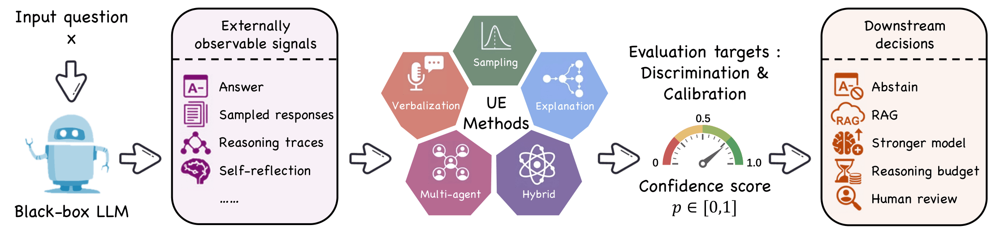
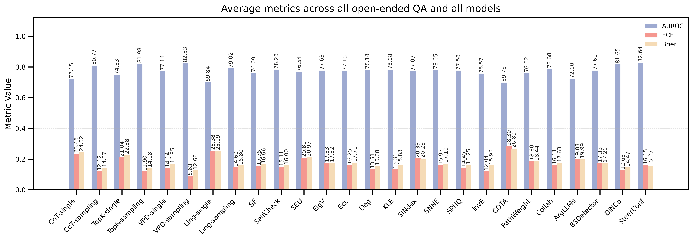
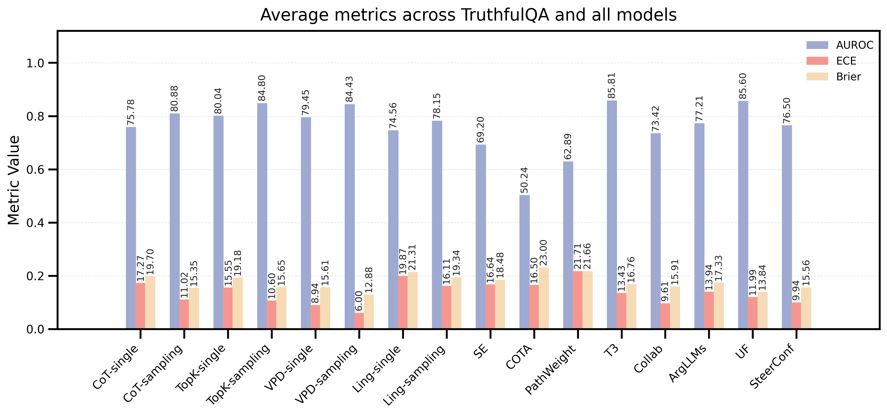

<a name="readme-top"></a>

<!-- <div align="center">
  
  
  
  
</div>

<br /> -->

<h1 align="center">🔥 The Hub for Black-Box Uncertainty Estimation in LLMs</h1>

<p align="center">
  <b>A curated hub and unified evaluation framework for black-box uncertainty estimation in large language models.</b>
</p>

<p align="center">
  
</p>

<!-- <p align="center">
  <a href="https://awesome.re"></a>
  
  
  
</p> -->

---

## 🔍 Overview

**Black-Box-UE-Hub** collects representative methods for **black-box uncertainty estimation (UE)** in **large language models (LLMs)**. The repository is intended to serve two complementary purposes:

- 📚 **Paper index**: a taxonomy-oriented collection of black-box UE methods, including venue, relative computation cost, calibration property, task applicability, and available code resources.
- 🧩 **Evaluation framework**: a unified pipeline for running selected black-box UE methods and evaluating uncertainty scores with common metrics such as AUROC, ECE, and Brier score.

Black-box UE is especially useful when model internals such as logits, hidden states, or gradients are unavailable. Instead, it estimates reliability from externally observable behavior, including verbalized confidence, sampled responses, reasoning traces, multi-agent deliberation, or combinations of these signals.


<details>
  <summary>📑 <b>Table of Contents</b></summary>
  <ol>
    <li><a href="#-overview">Overview</a></li>
    <li><a href="#-taxonomy">Taxonomy</a></li>
    <li><a href="#-how-to-read-the-tables">How to Read the Tables</a></li>
    <li><a href="#-method-catalog">Method Catalog</a>
      <ul>
        <li><a href="#%EF%B8%8F-verbalization-based">Verbalization-based</a></li>
        <li><a href="#-sampling-based">Sampling-based</a></li>
        <li><a href="#-explanation-based">Explanation-based</a></li>
        <li><a href="#-multi-agent">Multi-agent</a></li>
        <li><a href="#-hybrid">Hybrid</a></li>
      </ul>
    </li>
    <li><a href="#-framework">Framework</a></li>
    <li><a href="#-quick-start">Quick Start</a></li>
    <li><a href="#-evaluation-results">Evaluation Results</a></li>
    <li><a href="#-adding-a-new-method">Adding a New Method</a></li>
    <li><a href="#-contributing">Contributing</a></li>
  </ol>
</details>

---

## 🧭 Taxonomy

We organize black-box UE methods into five categories:

| Category | Main signal | Typical use case |
|---|---|---|
| 🗣️ **Verbalization-based** | The model is prompted to express its own confidence or probability distribution. | Low-cost confidence elicitation for both open-ended and closed-ended QA. |
| 🎲 **Sampling-based** | Multiple sampled outputs are compared through lexical, semantic, embedding, graph, or perturbation-based statistics. | Detecting instability, inconsistency, or semantic dispersion in generated answers. |
| 🧠 **Explanation-based** | Explanations, reasoning paths, or reasoning structures are used as uncertainty evidence. | Reasoning-heavy tasks where answer reliability depends on intermediate rationales. |
| 🤝 **Multi-agent** | Multiple agents, personas, or deliberation rounds are used to expose disagreement. | Higher-cost reliability estimation through interaction and debate. |
| 🧩 **Hybrid** | Multiple uncertainty sources or calibration mechanisms are combined. | Stronger calibration when a single signal is insufficient. |

---

## 📌 How to Read the Tables

- **Computation** indicates relative inference cost.
- **Calibration** indicates whether the method directly produces a confidence score in `[0, 1]` without requiring additional calibration or normalization.
- **Open-ended** and **Closed-ended** indicate whether the method is applicable to open-ended QA and/or closed-ended QA.
- **Code** links to publicly available implementations when listed in the survey table.

---

## 📚 Method Catalog

### 🗣️ Verbalization-based

| Method | Venue | Computation | Calibration | Open-ended | Closed-ended | Code |
|---|:---:|:---:|:---:|:---:|:---:|:---:|
| [TopK](https://arxiv.org/abs/2305.14975) | EMNLP 2023 | Low / Medium | ✅ | ✅ | ✅ | — |
| [CoT](https://arxiv.org/abs/2306.13063) | ICLR 2024 | Low / Medium | ✅ | ✅ | ✅ | [Code](https://github.com/MiaoXiong2320/llm-uncertainty) |
| [Verbalized Probability Distribution (VPD)](https://arxiv.org/abs/2402.00367) | arXiv 2025 | Low / Medium | ✅ | ✅ | ✅ | — |
| [Ling](https://arxiv.org/abs/2305.14975) | EMNLP 2023 | Low / Medium | ✅ | ✅ | ✅ | — |
| [Marker Confidence (MarConf)](https://arxiv.org/abs/2505.24778) | ACL 2025 | Low / Medium | ✅ | — | ✅ | [Code](https://github.com/HKUST-KnowComp/MarConf) |

<p align="right">(<a href="#readme-top">back to top</a>)</p>

---

### 🎲 Sampling-based

| Method | Venue | Computation | Calibration | Open-ended | Closed-ended | Code |
|---|:---:|:---:|:---:|:---:|:---:|:---:|
| [Semantic Entropy (SE)](https://arxiv.org/abs/2302.09664) | Nature 2024 | Medium | — | ✅ | ✅ | [Code](https://github.com/lorenzkuhn/semantic_uncertainty) |
| [SelfCheckGPT (SelfCheck)](https://arxiv.org/abs/2303.08896) | EMNLP 2023 | Medium | — | ✅ | — | [Code](https://github.com/potsawee/selfcheckgpt) |
| [Sum of Eigenvalues of the Graph Laplacian (EigV)](https://arxiv.org/abs/2305.19187) | TMLR 2024 | Medium | — | ✅ | — | [Code](https://github.com/zlin7/UQ-NLG) |
| [The Degree Matrix (Deg)](https://arxiv.org/abs/2305.19187) | TMLR 2024 | Medium | — | ✅ | — | [Code](https://github.com/zlin7/UQ-NLG) |
| [Eccentricity (Ecc)](https://arxiv.org/abs/2305.19187) | TMLR 2024 | Medium | — | ✅ | — | [Code](https://github.com/zlin7/UQ-NLG) |
| [Kernel Language Entropy (KLE)](https://arxiv.org/abs/2405.20003) | NeurIPS 2024 | Medium | — | ✅ | — | [Code](https://github.com/AlexanderVNikitin/kernel-language-entropy/tree/main/kle) |
| [Long-text Uncertainty Quantification (LUQ)](https://arxiv.org/abs/2403.20279) | EMNLP 2024 | Medium | ✅ | ✅ | — | [Code](https://github.com/caiqizh/LUQ) |
| [Jiang et al. (GU)](https://arxiv.org/abs/2410.20783) | NeurIPS 2024 | Medium | ✅ | ✅ | — | [Code](https://github.com/Mingjianjiang-1/Graph-based-Uncertainty) |
| [Semantic Embedding Uncertainty (SEU)](https://arxiv.org/abs/2410.22685) | arXiv 2024 | Medium | — | ✅ | — | — |
| [Multi-Dimensional Uncertainty Quantification (MDUQ)](https://arxiv.org/abs/2502.16820) | arXiv 2025 | Medium | — | ✅ | — | — |
| [Convex Hull](https://arxiv.org/abs/2406.19712) | DAI 2024 | High | — | ✅ | — | — |
| [Semantic INconsistency Index (SINdex)](https://arxiv.org/abs/2503.05980) | arXiv 2025 | Medium | — | ✅ | — | — |
| [Semantic Nearest Neighbor Entropy (SNNE)](https://arxiv.org/abs/2506.00245) | ACL Findings 2025 | Medium | — | ✅ | — | [Code](https://github.com/BigML-CS-UCLA/SNNE) |
| [Semantic Structural Entropy (SeSE)](https://arxiv.org/pdf/2511.16275) | arXiv 2025 | Medium | — | ✅ | — | [Code](https://github.com/SELGroup/SeSE) |
| [Sampling with Perturbation for Uncertainty Quantification (SPUQ)](https://arxiv.org/abs/2402.06164) | EACL 2024 | Medium | ✅ | ✅ | — | [Code](https://github.com/intuit-ai-research/SPUQ/tree/main) |
| [Inverse-Entropy (InvE)](https://arxiv.org/abs/2502.00628) | NeurIPS 2025 | Medium | — | ✅ | — | [Code](https://github.com/UMDataScienceLab/Uncertainty-Quantification-for-LLMs) |

<p align="right">(<a href="#readme-top">back to top</a>)</p>

---

### 🧠 Explanation-based

| Method | Venue | Computation | Calibration | Open-ended | Closed-ended | Code |
|---|:---:|:---:|:---:|:---:|:---:|:---:|
| [CoT Explanations (COTA)](https://arxiv.org/abs/2308.16175) | AISTATS 2024 | Medium | ✅ | ✅ | ✅ | — |
| [Think twice before trusting (T3)](https://arxiv.org/abs/2403.09972) | EMNLP Findings 2024 | Medium | ✅ | — | ✅ | — |
| [Topo-UQ](https://arxiv.org/abs/2502.17026) | COLM 2025 | Medium | ✅ | ✅ | — | [Code](https://github.com/LongchaoDa/LLM-Topology) |
| [Introspective UQ (IUQ)](https://arxiv.org/abs/2506.18183) | arXiv 2025 | Low / Medium | ✅ | ✅ | ✅ | — |
| [CenConf](https://arxiv.org/abs/2509.12908) | EMNLP 2025 | Medium | ✅ | ✅ | ✅ | — |
| [PathConv](https://arxiv.org/abs/2509.12908) | EMNLP 2025 | Medium | ✅ | ✅ | ✅ | — |
| [PathWeight](https://arxiv.org/abs/2509.12908) | EMNLP 2025 | Medium | ✅ | ✅ | ✅ | — |

<p align="right">(<a href="#readme-top">back to top</a>)</p>

---

### 🤝 Multi-agent

| Method | Venue | Computation | Calibration | Open-ended | Closed-ended | Code |
|---|:---:|:---:|:---:|:---:|:---:|:---:|
| [CollabCalibration (Collab)](https://arxiv.org/abs/2404.09127) | ICLR Workshop 2024 | High | ✅ | ✅ | ✅ | [Code](https://github.com/minnesotanlp/collaborative-calibration) |
| [ArgLLMs](https://arxiv.org/abs/2405.02079) | AAAI 2025 | Medium | ✅ | ✅ | ✅ | [Code](https://github.com/CLArg-group/argumentative-llms) |
| [DiverseAgentEntropy (DAE)](https://arxiv.org/abs/2412.09572) | EMNLP Findings 2025 | High | — | ✅ | ✅ | [Code](https://github.com/amazon-science/DiverseAgentEntropy) |

<p align="right">(<a href="#readme-top">back to top</a>)</p>

---

### 🧩 Hybrid

| Method | Venue | Computation | Calibration | Open-ended | Closed-ended | Code |
|---|:---:|:---:|:---:|:---:|:---:|:---:|
| [BSDetector](https://arxiv.org/abs/2308.16175) | ACL 2024 | Medium | ✅ | ✅ | — | — |
| [UF Calibration (UF)](https://arxiv.org/abs/2404.02655) | EMNLP 2024 | Medium | ✅ | — | ✅ | — |
| [SteerConf](https://arxiv.org/abs/2503.02863) | NeurIPS 2025 | Medium | ✅ | ✅ | ✅ | [Code](https://github.com/scottjiao/SteerConf) |
| [Distractor-Normalized Coherence (DiNCo)](https://arxiv.org/abs/2509.25532) | ICLR 2026 | Medium | ✅ | ✅ | — | [Code](https://github.com/victorwang37/dinco) |

<p align="right">(<a href="#readme-top">back to top</a>)</p>

---

## 🧱 Framework

The code framework is organized around a batch pipeline and a shared method interface. It includes implementations of the major black-box UE methods currently supported in this repository, and new methods can be added progressively under the same interface.

### Core Directory Layout

```text
Black-Box-UE-Hub/
├── run_pipeline.py                  # batch runner for generation, extraction, and UE scoring
├── judge.py                         # answer correctness judging
├── eval.py                          # AUROC, ECE, Brier, and other evaluation metrics
├── run_pipeline.methods.example.yaml # example method configuration
├── dataset/                         # local datasets or processed data files
├── output/                          # method outputs and scored JSON files
├── sample/                          # sampled responses and intermediate caches
└── src/
    ├── config.py                    # project paths and model settings
    ├── dataset/                     # dataset loaders and preprocessing
    ├── method/                      # black-box UE method implementations
    ├── model/                       # local/API model adapters
    └── utils.py                     # shared parsing, sampling, similarity, and evaluation helpers
```

### Method Interface

Each runnable method is expected to follow the same three-stage interface:

```python
class ExampleMethod:
    def generate(self, ...):
        """Generate model outputs, sampled responses, or intermediate caches."""

    def extract(self, ...):
        """Parse raw outputs into method-specific fields."""

    def calculate(self, ...):
        """Compute uncertainty scores and save them to the output file."""
```

---

## 🚀 Quick Start

### 1. Configure Paths and Models

Update project paths, model names, API settings, and output directories in:

```text
src/config.py
```

Adjust method-specific arguments in:

```text
run_pipeline.methods.example.yaml
```

### 2. Run the Pipeline

```bash
python run_pipeline.py \
  --models qwen3-4b-instruct qwen3-30b-instruct \
  --datasets triviaqa coqa hotpotqa truthfulqa_mc \
  --methods cot topk \
  --steps generate extract calculate
```

### 3. Judge Answer Correctness

```bash
python judge.py \
  --methods cot topk \
  --datasets triviaqa hotpotqa coqa truthfulqa_mc \
  --models qwen3-4b-instruct qwen3-30b-instruct deepseek-v3.2 gpt-5-mini
```

### 4. Evaluate Uncertainty Scores

```bash
python eval.py \
  --methods cot topk \
  --datasets triviaqa hotpotqa coqa truthfulqa_mc \
  --models qwen3-4b-instruct qwen3-30b-instruct deepseek-v3.2 gpt-5-mini
```

---

## 📊 Evaluation Results

We report aggregate evaluation results of representative black-box UE methods on open-ended and closed-ended QA tasks. Bar charts summarize the overall comparison across AUROC, ECE, and Brier score, while the table images provide more detailed numerical results for different method groups.

### Open-ended QA

<p align="center">
  
</p>

#### Verbalization-based methods
<p align="center">
  
</p>

#### Sampling-based methods
<p align="center">
  
</p>

#### Other methods
<p align="center">
  
</p>

### Closed-ended QA

<p align="center">
  
</p>

<p align="center">
  
</p>
---

## 🧩 Adding a New Method

To add a new black-box UE method:

1. Create a new method file under `src/method/`.
2. Implement the `generate`, `extract`, and `calculate` stages.
3. Add method-specific arguments to `run_pipeline.methods.example.yaml`.
4. Run the method through `run_pipeline.py`.
5. Evaluate the saved uncertainty scores with `eval.py`.

---

## 🤗 Contributing

Contributions are welcome. Please open an Issue or Pull Request if you find:

- missing or newly released black-box UE papers,
- broken paper or code links,
- incorrect venue, taxonomy, or applicability information,
- missing implementation details,
- bugs in the evaluation pipeline.


<!-- ## 📜 Citation

If you find this repository useful, please cite the corresponding survey or this repository. The BibTeX entry can be updated once the final survey metadata is available.

```bibtex
@misc{blackboxuehub2026,
  title        = {Black-Box-UE-Hub: A Hub for Black-Box Uncertainty Estimation in Large Language Models},
  howpublished = {\url{https://github.com/<YOUR_GITHUB_ID>/Black-Box-UE-Hub}},
  year         = {2026}
}
```

<p align="right">(<a href="#readme-top">back to top</a>)</p> -->
